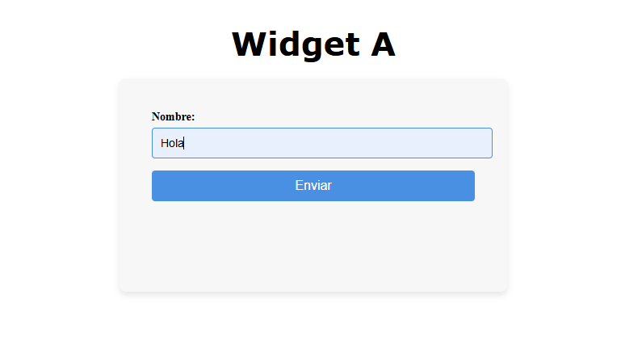
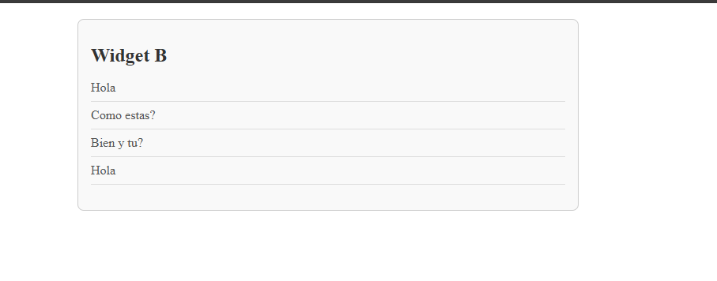

Archivo README.md

Pasos para instalar Dependencias.

1 - Lo primero que debemos hacer es colocarnos en las carpetas que contienen los proyectos, WidgetA, WidgetB y socketServer (cd "nombre de carpeta")

2 - Hacemos un npm install, para descargar las dependencias en cada carpeta.

3 - Luego hacemos un "npm run build" de ambos widget para que se generen los archivos a mostrar en el index.html e index2.html

4 - Subimos el servidor socket con el comando "node socketServer.js"

5 - Ya con todos estos pasos completados, abrimos los archivos index.html e index2.html y probamos la comunicacion.

